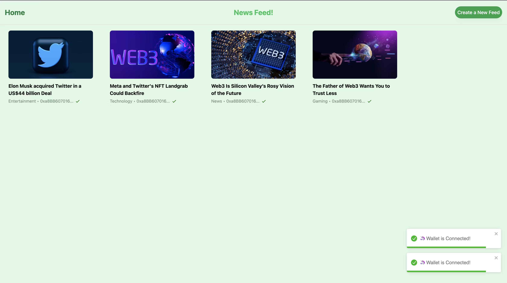
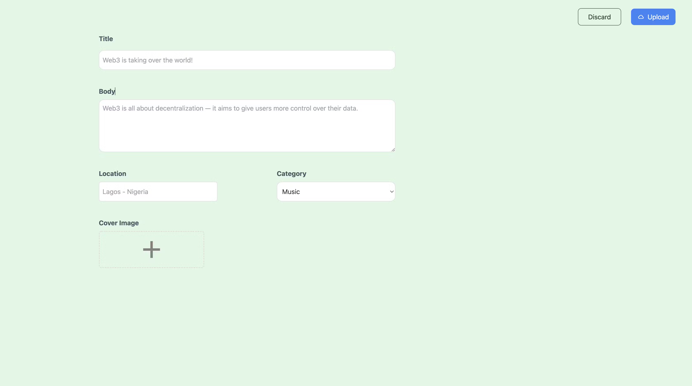
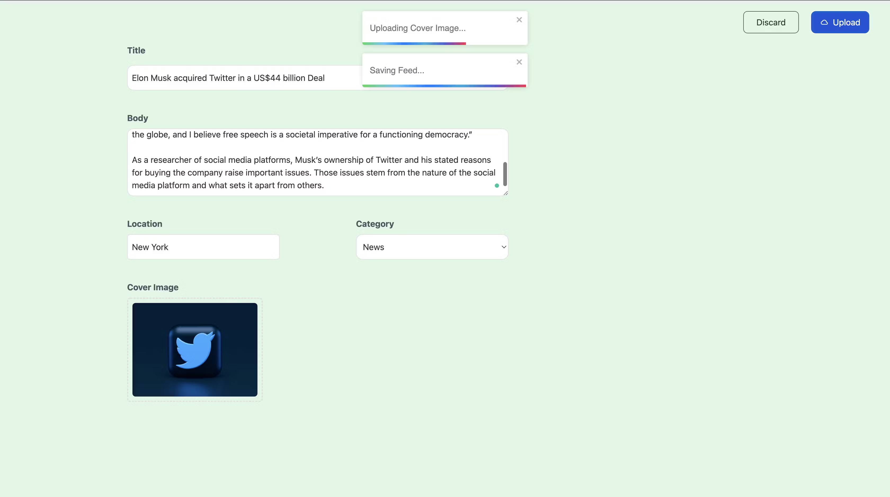
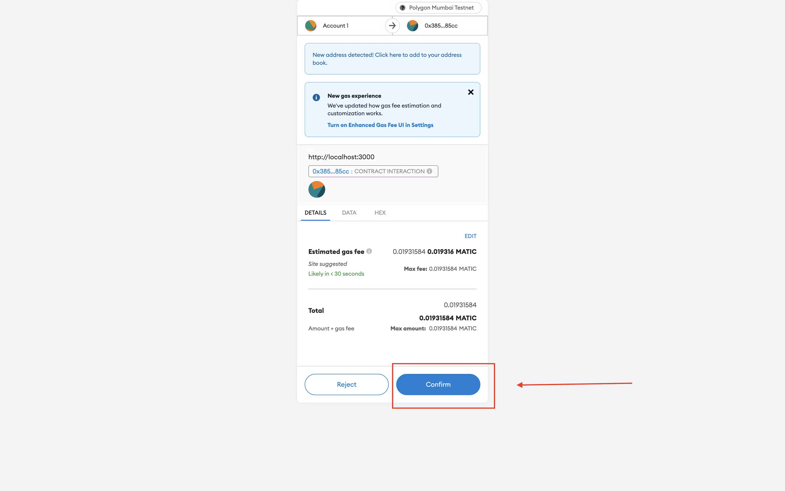

## Decentralized News Feed with React, TailwindCSS, Ethers.js, IPFS, and Solidity

**Overview**

This project demonstrates how to build a decentralized news feed using React, TailwindCSS, Ethers.js, IPFS, and Solidity. The news feed leverages blockchain technology to ensure the authenticity and immutability of news articles.

**Key Features**

* **Decentralized Storage:** News articles are stored on the Interplanetary File System (IPFS) for decentralized and censorship-resistant storage.
* **Blockchain Verification:** The authenticity of news articles is verified using blockchain technology.
* **User-Friendly Interface:** A React frontend with TailwindCSS styling provides a clean and intuitive user interface.
* **Ethers.js Integration:** Ethers.js is used to interact with the blockchain and smart contract.


**The project images are as follows:**






**Prerequisites**

* Node.js and npm (or yarn) installed
* A Metamask wallet or similar Ethereum wallet
* An IPFS node running (you can use a public IPFS gateway for testing)

**Installation**

1. Clone the repository:
   ```bash
   git clone https://github.com/mishraji874/Decentralized-News-Feed.git
   ```
2. Navigate to the project directory:
   ```bash
   cd decentralized-news-feed
   ```
3. Install dependencies:
   ```bash
   npm install
   ```

**Running the Project**

1. Create a `.env` file at the root of the project.
2. Add your Ethereum network provider URL (e.g., from Infura or Alchemy) and the Private Key.
3. Create your IPFS node on the infura and then add it inside the `client/src/UploadPage.js` and replace the content inside of the create function with your node details:
   ```javascript
   const client = create("https://ipfs.infura.io:5001/api/v0");
   ```
4. Install all the dependencies inside the `client` folder:
   ```bash
   npm install
   ```
5. Start the development server:
   ```bash
   npm start
   ```
   The project will be accessible at http://localhost:3000.

**How it Works**

1. **User Interaction:** Users can submit new news articles through the frontend.
2. **IPFS Storage:** The article content is uploaded to IPFS and a content hash (CID) is generated.
3. **Smart Contract Interaction:** The CID is stored on the blockchain using a smart contract.
4. **Fetching and Display:** The frontend fetches the CIDs from the blockchain and retrieves the corresponding content from IPFS to display the news feed.

**Additional Notes**

* You can customize the frontend and backend to suit your specific requirements.
* Consider implementing additional features like user accounts, voting mechanisms, or content moderation.
* Ensure proper error handling and user experience throughout the application.

**Contributing**

Feel free to contribute to this project by submitting pull requests or raising issues.
